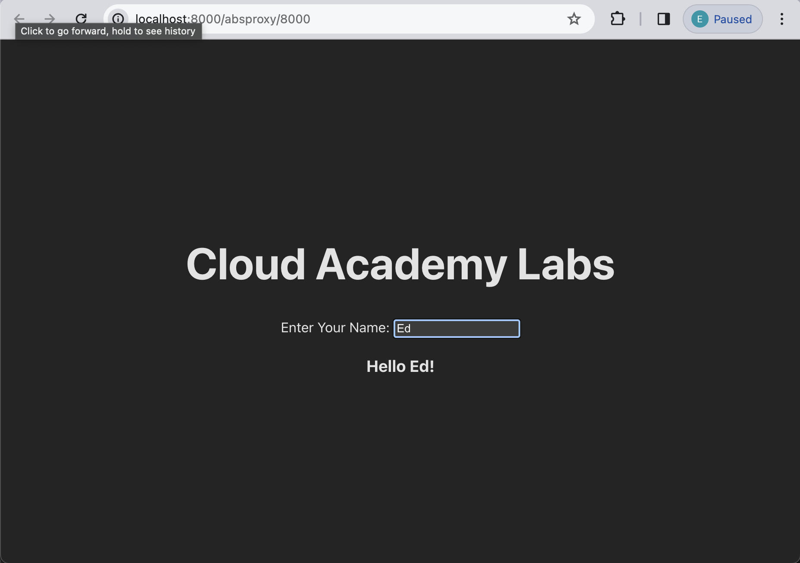

# React: Introduction to onChange Event Handling

## Setup 
Before we begin writing code, let's setup the project and install all necesarry packages.
Open a new Terminal window and do the following steps:

1. Go to `calab` directory:
    ```
    cd calab
    ```
2. Install npm packages:
    ```
    npm install
    ```
3. Start the application:
    ```
    npm run dev
    ```
    You should see the development server being started:
    []() 

    If you open the `Local` URL in a new browser tab, you should see the follwoing:
    []()    


## Steps 

1. Create a variable called `name` using `useState` React hook.
    -   Import React State hook.
        ```
        import { useState } from 'react'
        ```
    -   Inside `App()` function, declare a `name` variable and it's setter.
        ```
        const [name, setName] = useState();
        ```

2. Create an input and it's label.
    -   Just below `<h1>` tag, create a `<label>` element.
        ```
        <label>Enter Your Name: </label>
        ``` 
    -   After `<label>` element, add the following JSX to render an `<input>` element.
        ```
        <input/>
        ```
3. Conditionaly display the name.
    -   If name exists, display the `<h3>` element with text: "Hello name!". Add the following code just below the `<input>` element.
        ```
        {name && <h3> Hello {name}!</h3>}
        ```


###  Handle on change events

4. Create a function called `onChangeHandler`.
    -   Declare a function called `onChangeHandler`
    -   Make that function call  `setName` and pass the current value of the `<input>`.
        ```
        const onChangeHandler = (event) => {
            setName(event.target.value)
        }
        ```

5. Attach the onChange event handler to a input. 
    -   On the `<input>`, add a new prop, onChange = (handleChange).
        ```
        <input onChange={onChangeHandler}/>
        ```


Now go to development server and start typing you name to the input box. You should See the greeting appeading as soon as you type in the first letter. 
[]()  

[]()    